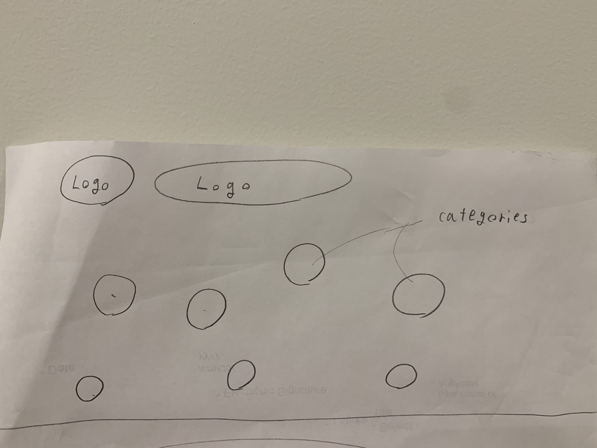
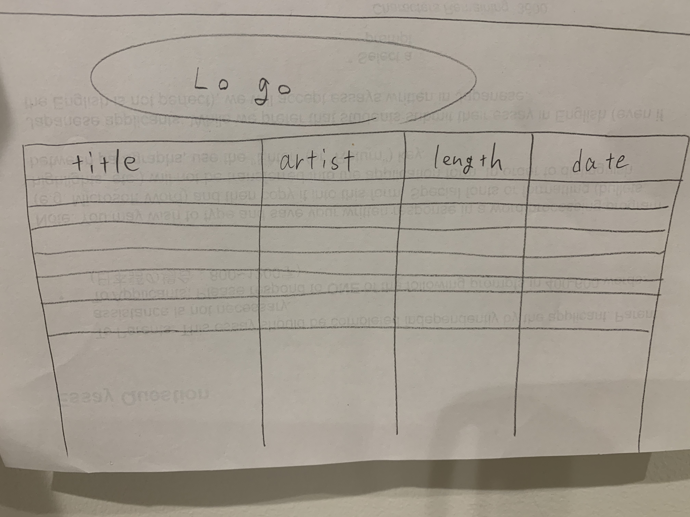

# Record of Task #
This table reflects the five stages of design

| Task Number | Planned Action | Expected Outcome | Time Estimated | Target Completion | Criteria |
|-------------| ---------------|------------------|----------------|-------------------|----------|
|      1      | **Planning** Meet with client for a first conversation | ①Obtain the basic client requirements   | 30 min | The client's needs for the application was very clear and simple so I got to come up with some basic requirements | A |
|      2      | **Design** Draw some blief sketches for the User Interface of the application | ①Draw the blief sketch for User Interface that meets client's needs that I obtained in the last meeting ②Show the sketch to the client and find out any improvements | 30 min + 10 min | I got inspired by a certain music app and sketch the UI by including some jokes. And my client was satisfied with the design and system. | A |
|      3      | **Development** Create log-in system for the application | ①Create the system that encrypts the password which is typed by users ②create the system that shows the data or jump to other page if the user type correct password | 60 min | During the class, I was kind of confused by the encrypting system that originally exists in Python. I need to practice more | B |
|      4      | **Design** Create GUI for the application with QT designer | ①Learn how to use QT designer ②Make creative and user friendly GUI based on the client's needs | 240 min | I spend too much time on this because I'm not really used to QT designer. However, I'm really satisfied with the design of GUI | A | 


Unit3 Inventory Project
=======================

Contents
----------
1. [Planning](#planning)
1. [Design](#Design)
1. [Development](#Development)
1. [Evaluation](#Evaluation)


## Planning ##
### Defining problem ###
This is the g-mail I got from my client. Based on this, I designed my application making making sure that it meets client's needs
```
I have a lot of music but no interesting way to quickly sort them or find specific songs. 
It would be  very nice if I could sort my songs into categories or based on information about them. 
I would like an app that would sort and categorize my music for more pleasant listening
```

## Proposed Solutuion ##
Create a software application which sorts musics into 7 categories which is "Rock", "EDM", "Reggae", "Game", "Hiphop", "J-pop" and "K-pop". And also the application shows the songs' title, artsit, length of time and when the song was added to playlist in Spotify. This database will be only used by my client(Shin)

## First sketches for proposed solution ##

**First sketch for login page**
I'm plannning to create a own logo for my application and put it on the top of every pages. I will refer Spotify's design and logo for my application as it is related to spotify.


**First sketch for main page**
I wanted to make a unique main page so I decided to make 7 bubbles which represent each categories of music. So if user click on the bubble called "Rock", it jumps to database of rock songs. There is one problem which is I need to create 7 database pages and the size of application would be large.


**First sketch for database page**
I made a database page which shows title, artsit, length and dates clearly and looks similar to spotify.

## Success Criteria for the software system ##
1. Secure login system that only allows the client to login
1. It is able to be edit and delete by user
1. Songs are sorted in 7 categories 
1. It shows the title, artist, length of time and the date that songs were added
1. Manual is added to the software
1. Easy to use(it should be easy for begginers)

## Design ##

## Development ##
### Making secure log-in system ###
*What is hash ?*
```
hash is a fingerprint of some digital data. If you covert exact same word, hash is also exact same. It is NOT random.
All hash have same length.
```
*What is byte and bit?*
```
bit is a unit measuring the size of data. 8bits = 1 byte 
```
*what is ascii*
```
a code that is comprised of [0, 1] which is converted from other digits or strings.
It is an initial code and that can represent 256 characters.
```
*what is unicode and UTF-8*
```
These are basically same as ascii but they were invented for the sake of more complicated language.
UTF-8 is compatible with ascii as it shows the ascii part with 1 byte and other parts with 2 - 6 bytes.
```
**CODE which encodes the password typed by user.**
```
def hash_password(password):
    """hash a password for string"""
    salt = hashlib.sha256(os.urandom(60)).hexdigest().encode('ascii')
    pwdhash = hashlib.pbkdf2_hmac('sha512', password.encode('utf-8'), salt, 100000)
    pwdhash = binascii.hexlify(pwdhash)
    return (salt + pwdhash).decode('ascii')
```
**CODE which verifying the password set by users initially is equal to the password user typed now**
```
def verify_password(stored_password, provided_password):
    """Verify a stored password against one provided by user"""
    salt = stored_password[:64]
    stored_password = stored_password[64:-1]
    pwdhash = hashlib.pbkdf2_hmac('sha512',
                                  provided_password.encode('utf-8'),
                                  salt.encode('ascii'),
                                  100000)
    pwdhash = binascii.hexlify(pwdhash).decode('ascii')
    return pwdhash == stored_password
```
