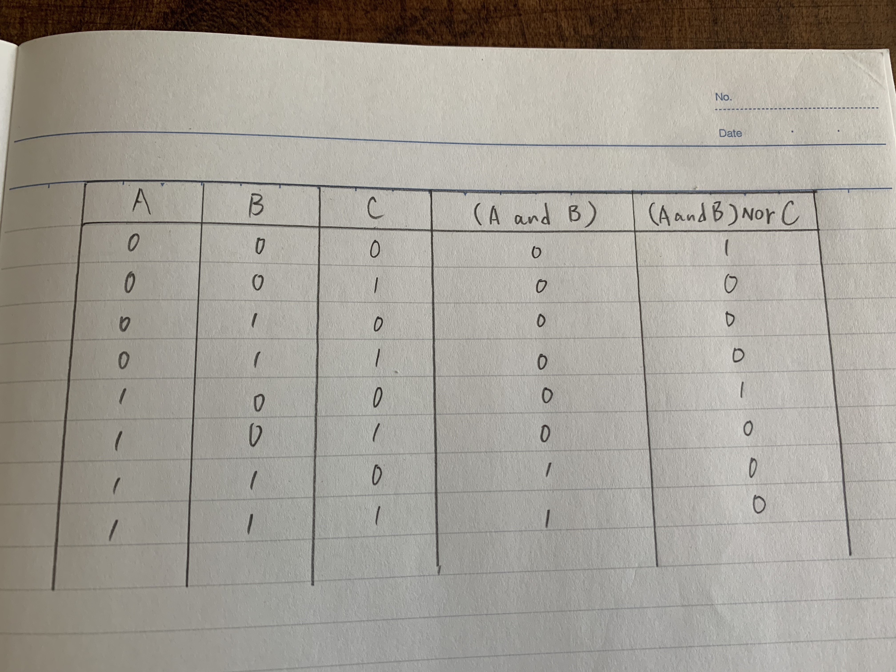

# Syllabus Questions #
## Question 1 ##
Mobile devices are becoming smaller and smaller every year for the convinience of carrying it. But one usability issue is small monitor. It sometimes makes users frustrated because of its inconvinience for example, pushing another button, delete something accidentally, mistyping and pushing ads.

## Question 2 ##

## Question 3 ##
A protocol is a standard set of rules that allow electronic devices to communicate with each other. These rules include what type of data may be transmitted, what commands are used to send and receive data, and how data transfers are confirmed.
