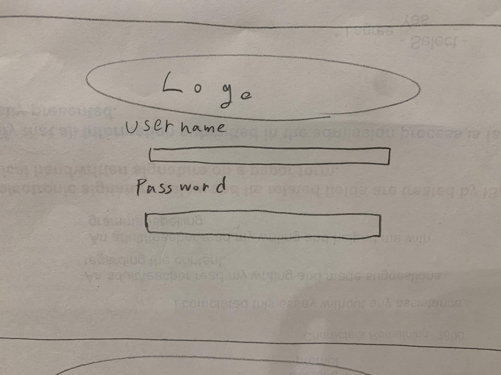
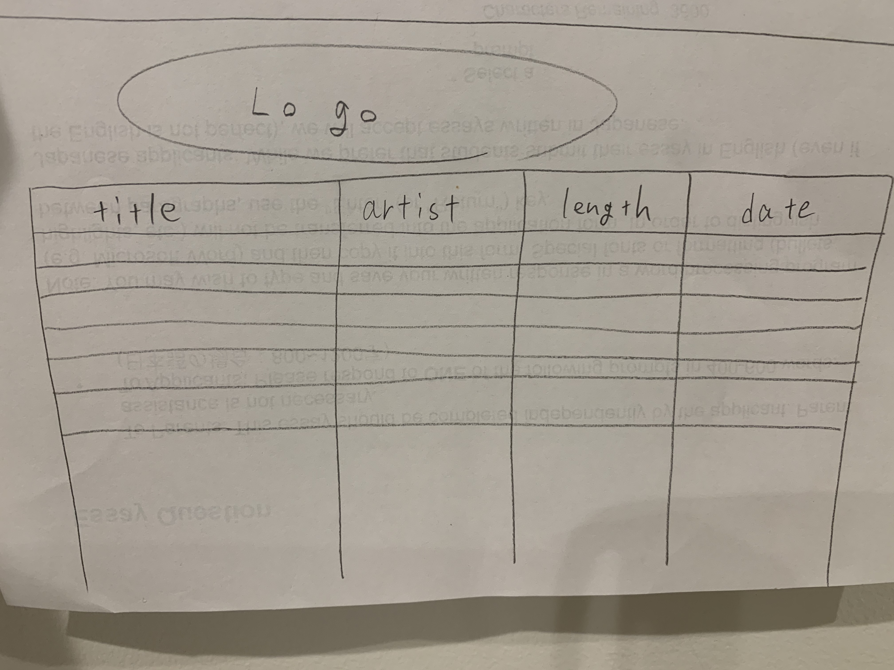

# CRITERIA A for the software application #

## Defining Problem ##
This is the g-mail I got from my client. Based on this, I designed my application making making sure that it meets client's needs
```
I have a lot of music but no interesting way to quickly sort them or find specific songs. 
It would be  very nice if I could sort my songs into categories or based on information about them. 
I would like an app that would sort and categorize my music for more pleasant listening
```

## Proposed Solutuion ##
Create a software application which sorts musics into 7 categories which is "Rock", "EDM", "Reggae", "Game", "Hiphop", "J-pop" and "K-pop". And also the application shows the songs' title, artsit, length of time and when the song was added to playlist in Spotify. This database will be only used by my client(Shin)

## First sketches for proposed solution ##

**First sketch for login page**
I'm plannning to create a own logo for my application and put it on the top of every pages. I will refer Spotify's design and logo for my application as it is related to spotify.


**First sketch for main page**
I wanted to make a unique main page so I decided to make 7 bubbles which represent each categories of music. So if user click on the bubble called "Rock", it jumps to database of rock songs. There is one problem which is I need to create 7 database pages and the size of application would be large.



## Success Criteria for the software system ##
1. Secure login system that only allows the client to login
1. It is able to be edit and delete by user
1. Songs are sorted in 7 categories 
1. It shows the title, artist, length of time and the date that songs were added
1. Manual is added to the software
1. Easy to use(it should be easy for begginers)


