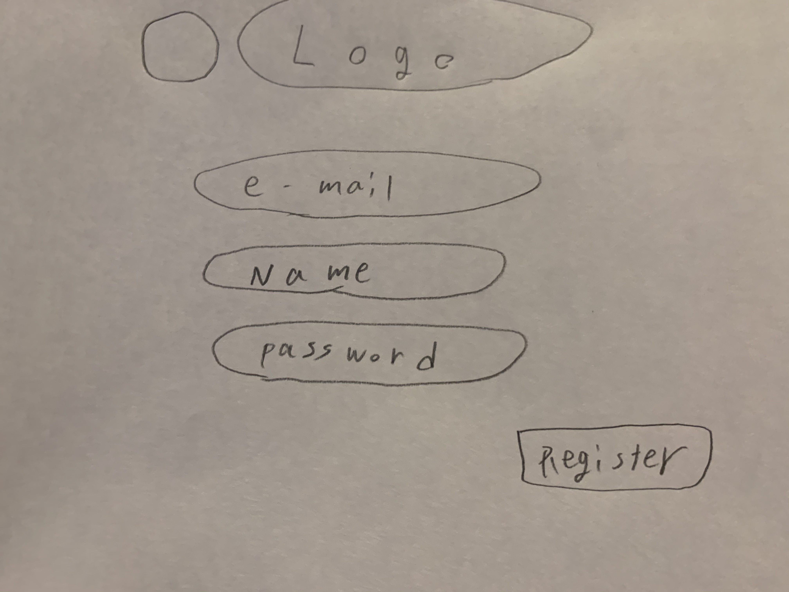
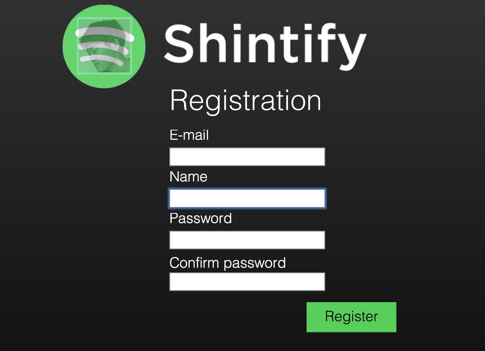
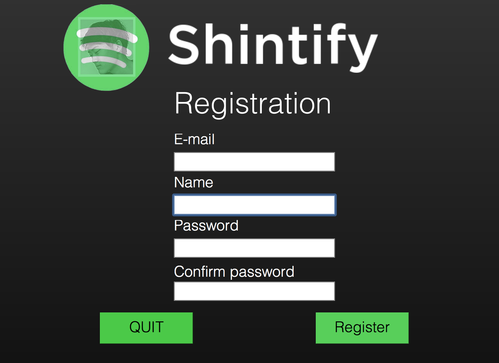
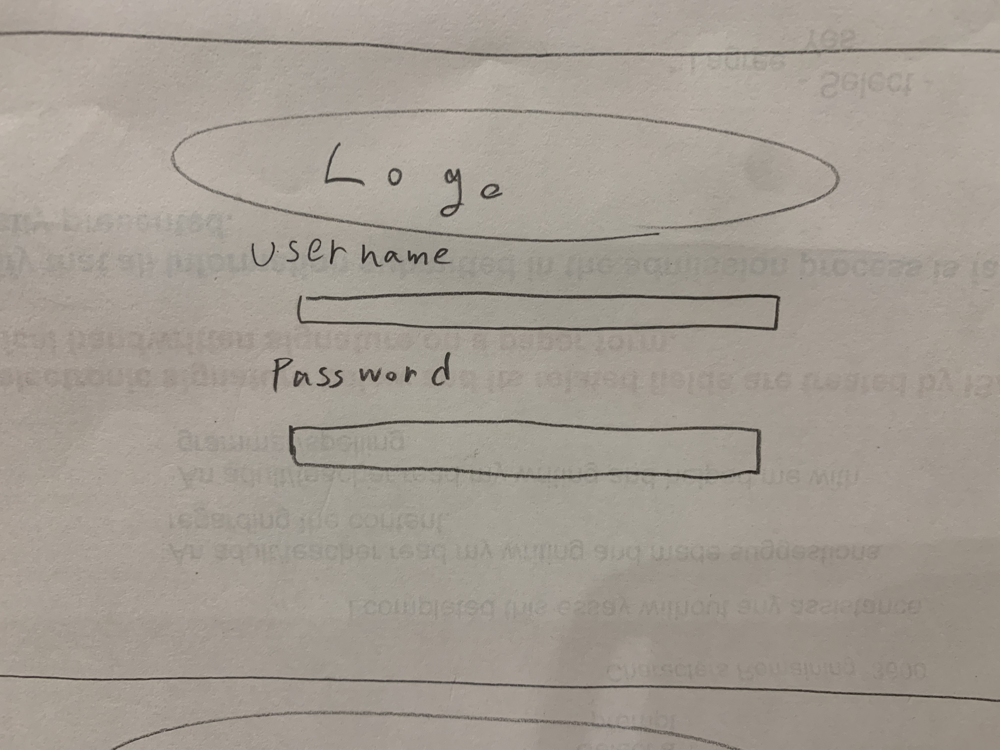
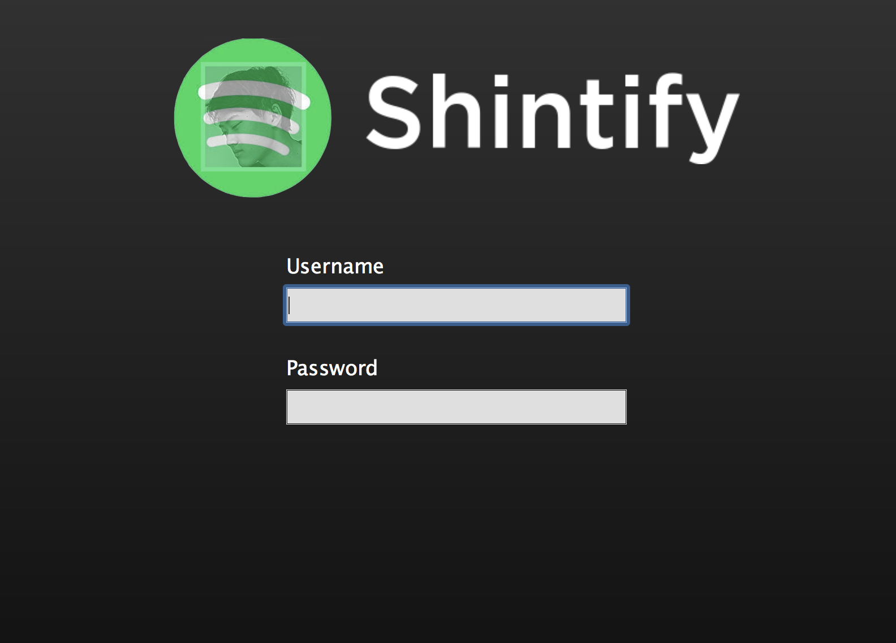

# Criteria B design #

Contents
--------------
1. [System Diagram](#system_diagram)
1. [Desings for Registration System](#registration)
1. [Desings for login system](#loginpage)

System Diagram
--------------

 Registration 
 ----------------------------
**First sketch for registration page**

Users type in their e-mail address, name and password. Very straightforward and minimized design for encoding the password typed by user.

**Second design**

I added the confirmation button to check if the password typed at first is same as one user thinks.
I spent much time on back ground color to make it similar to Spotify.

**Final design (to be released)**

Lastly, I added the quit button for registration form as well which enables user to exit registration page if they've already done log-in.

LoginPage
------------
**First sketch for login page**

Users type in their username and password every time they open the home page of the application. And I put the logo at the top of the page.

**Second design**

I made the exact same design in qt designer. And I set the gradation of black color in background color to make it looks Spotify. 
