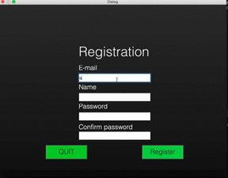
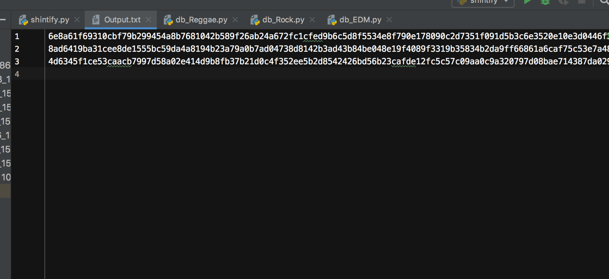

# CriteriaD Testing #
The Logos are not displayed in the testing video because of Python's problem.
But the system itelf is working.

## Registration System ##
1. Users are able to type in text box
1. Password that is typed by user will be stored in Output.txt
1. If the "regiter" button is clicked, it jumps to login page.

## Login System ##
1. Users are able to type in text box
1. 
