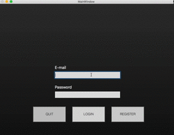
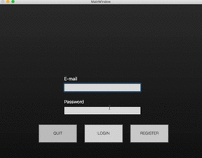
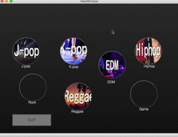
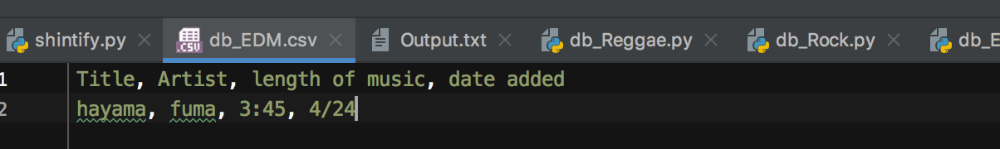
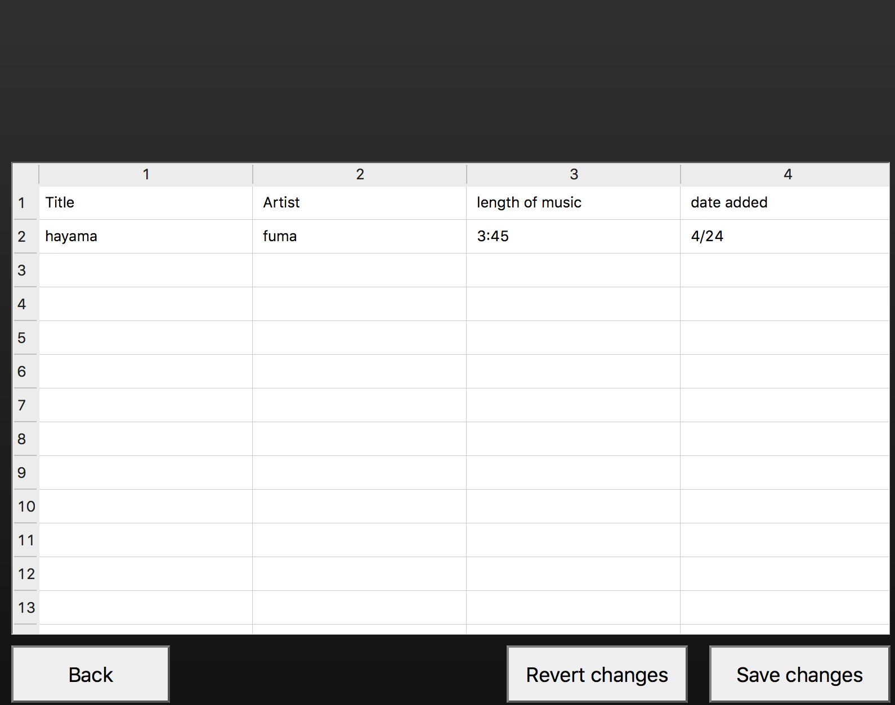

# CriteriaD Testing #
The Logos are not displayed in the testing video because of Python's problem.
But the system itelf is working.

## Registration System ##
1. Users are able to type in text box
1. Password that is typed by user will be stored in Output.txt
1. If the "regiter" button is clicked, it jumps to login page.

## Login System (verification) ##
1. Users are able to type in text box
1. It verifies the password typed in login window and the one in Output.txt are same.
1. If the password is correct, it jumps to homepage

## Login System (errors message) ##
1. Text boxes become orange if they are empty
1. Text boxes become green if they are filled properly
1. Email text box becomes orange if @ is not included in email typed by user.

## Home Page ##
1. Each buttons are connected to each database page

## Database Page ##
1. This page is connected to homepage
1. The data which is in csv file is read
1. The table widget shows the data of csv file

